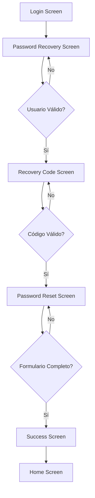

# Flujo: Olvidé mi Contraseña

## Descripción General
El flujo "Olvidé mi contraseña" permite a los usuarios de CIEmpresas recuperar el acceso a su cuenta cuando han olvidado su contraseña. Este proceso incluye validación de identidad, generación de códigos de recuperación y restablecimiento seguro de credenciales.

## Arquitectura del Flujo

### 1. Pantalla de Recuperación de Contraseña
**Archivo:** `lib/features/affiliation/screens/password_recovery_screen.dart`
**Ruta:** `/password-recovery`

#### Funcionalidades:
- **Campo de entrada:** Usuario o número de celular
- **Validación:** Verifica que el usuario exista en el sistema
- **Navegación:** Redirige al usuario a la pantalla de código de recuperación

#### Elementos de UI:
- Título: "Recuperación de Contraseña"
- Subtítulo: "Ingresa tu usuario o número de celular con el que inicias tu sesión en CIEmpresas"
- Campo de texto para usuario/celular
- Botones: "Continuar" y "Cancelar"
- Imagen de progreso: `progress_four.png`

#### Validaciones:
- Campo requerido
- Formato de usuario o número de celular válido
- Existencia del usuario en el sistema

---

### 2. Pantalla de Código de Recuperación
**Archivo:** `lib/features/affiliation/screens/recovery_code_screen.dart`
**Ruta:** `/recovery-code`

#### Funcionalidades:
- **Campo de entrada:** Código de recuperación (máximo 15 caracteres)
- **Validación:** Verifica que el código sea válido
- **Reenvío:** Permite solicitar un nuevo código
- **Navegación:** Redirige a la pantalla de restablecimiento de contraseña

#### Elementos de UI:
- Título: "Código de Recuperación"
- Subtítulo: "Ingrese el código de recuperación que te enviamos por correo electrónico o mensaje de texto"
- Campo de texto para el código (con toggle de visibilidad)
- Enlace: "¿No has recibido el código? Reenviar"
- Botones: "Continuar" y "Cancelar"
- Imagen de progreso: `progress_five.png`

#### Validaciones:
- Código requerido
- Código válido según el sistema
- Manejo de errores de validación

#### Estados de Error:
- **Error de validación:** Muestra mensaje específico en la UI
- **Error de servidor:** Muestra MaterialBanner con opción de cerrar

---

### 3. Pantalla de Restablecimiento de Contraseña
**Archivo:** `lib/features/affiliation/screens/password_reset_screen.dart`
**Ruta:** `/password-reset`

#### Funcionalidades:
- **Campo de usuario:** Mostrado (deshabilitado) con ofuscación
- **Nueva contraseña:** Campo con validaciones de seguridad
- **Confirmar contraseña:** Verificación de coincidencia
- **NIP:** Creación de NIP de 6 dígitos
- **OTP:** Generación automática al completar el NIP
- **Guardado:** Actualización de credenciales en el sistema

#### Elementos de UI:
- Título: "Recuperación"
- Subtítulo: "Ingrese una nueva contraseña con la que iniciarás tu sesión en CIEmpresas"
- Campo de usuario (ofuscado y deshabilitado)
- Campo de nueva contraseña (con toggle de visibilidad)
- Campo de confirmar contraseña (con toggle de visibilidad)
- Campo de NIP (6 dígitos con PinCodeTextField)
- Campo de OTP (generado automáticamente)
- Tooltip con reglas de contraseña
- Botones: "Guardar cambios" y "Cancelar"
- Imagen de progreso: `progress_seven.png`

#### Validaciones:
- Contraseña requerida
- Confirmación de contraseña requerida
- Coincidencia entre contraseñas
- NIP de 6 dígitos requerido
- OTP válido generado automáticamente

#### Reglas de Contraseña:
- Máximo 8 caracteres alfanuméricos
- No repetir contraseñas recientes
- Sin secuencias (abc, 123, zyx)
- Sin caracteres repetidos (aa, 11)

#### Proceso de Generación de OTP:
1. Usuario completa el NIP de 6 dígitos
2. Sistema genera OTP automáticamente
3. OTP se muestra en campo de texto enmascarado
4. Validación de formulario se actualiza

---

### 4. Pantalla de Éxito
**Archivo:** `lib/features/affiliation/screens/success_screen.dart`
**Ruta:** `/success`

#### Funcionalidades:
- **Mensaje de confirmación:** Confirma el cambio exitoso
- **Redirección:** Navega automáticamente al home
- **Finalización:** Cierra el flujo de recuperación

#### Elementos de UI:
- Mensaje: "¡La contraseña se ha actualizado con éxito!"
- Botón: "Finalizar"
- Redirección automática al home

---

## Flujo de Navegación

## Providers y Servicios Utilizados

### Providers:
- `CredentialSetupProvider`: Maneja validación de códigos de recuperación
- `ChangePasswordProvider`: Gestiona el cambio de contraseña
- `OtpGenerationProvider`: Genera OTPs automáticamente

### Servicios:
- `RestManagerV2`: Comunicación con APIs
- `SecureStorageService`: Almacenamiento seguro de datos
- `OfuscacionReversible`: Ofuscación de datos sensibles

## Validaciones de Seguridad

### 1. Validación de Usuario:
- Verificación de existencia en el sistema
- Validación de formato (usuario o celular)

### 2. Validación de Código:
- Código único y temporal
- Verificación de validez en el servidor
- Manejo de intentos fallidos

### 3. Validación de Contraseña:
- Reglas de complejidad
- Verificación de contraseñas recientes
- Coincidencia de confirmación

### 4. Validación de NIP y OTP:
- NIP de 6 dígitos
- OTP generado automáticamente
- Validación de seguridad

## Manejo de Errores

### Tipos de Error:
1. **Errores de Validación:** Mostrados en la UI del formulario
2. **Errores de Servidor:** Mostrados en MaterialBanner
3. **Errores de Red:** Manejo de conectividad
4. **Errores de Formato:** Validación de campos

### Estrategias de Recuperación:
- Reenvío de códigos de recuperación
- Limpieza automática de errores al cambiar campos
- Opciones de cancelación en cada paso
- Redirección al login en caso de error crítico

## Consideraciones de UX

### 1. Progreso Visual:
- Imágenes de progreso en cada pantalla
- Indicadores claros del paso actual

### 2. Feedback al Usuario:
- Loading indicators durante operaciones
- Mensajes de error claros y específicos
- Confirmaciones de éxito

### 3. Accesibilidad:
- Campos con etiquetas descriptivas
- Toggles de visibilidad para contraseñas
- Navegación por teclado

### 4. Seguridad:
- Ofuscación de datos sensibles
- Timeouts de sesión
- Validación en tiempo real

## Internacionalización

### Idiomas Soportados:
- Español (es)
- Inglés (en)

### Claves de Traducción Principales:
- `recover_password_title`
- `recover_password_subtitle`
- `recover_password_recovery_code_title`
- `recover_password_recovery_new_password_title`
- `successful_change_password`
- `rules_password`

## Archivos Relacionados

### Pantallas:
- `password_recovery_screen.dart`
- `recovery_code_screen.dart`
- `password_reset_screen.dart`
- `success_screen.dart`

### Providers:
- `credential_setup_provider.dart`
- `change_password_provider.dart`
- `otp_generation_provider.dart`

### Servicios:
- `change_password_service.dart`
- `secure_storage_service.dart`
- `ofuscacion_reversible.dart`

### Rutas:
- `app_routes.dart`
- `route_generator.dart`

### Traducciones:
- `assets/lang/es.json`
- `assets/lang/en.json`

## Notas de Implementación

1. **Ofuscación de Datos:** El usuario se muestra ofuscado en la pantalla de restablecimiento
2. **Generación Automática de OTP:** Se genera automáticamente al completar el NIP
3. **Validación en Tiempo Real:** Los campos se validan mientras el usuario escribe
4. **Manejo de Estado:** Uso de Provider para gestión de estado global
5. **Navegación Segura:** Limpieza de stack de navegación al finalizar

## Próximas Mejoras Sugeridas

1. **Autenticación Biométrica:** Integración con Face ID/Touch ID
2. **Notificaciones Push:** Alertas de cambio de contraseña
3. **Historial de Cambios:** Registro de cambios de contraseña
4. **Preguntas de Seguridad:** Método alternativo de recuperación
5. **Análisis de Seguridad:** Evaluación de fortaleza de contraseña en tiempo real 